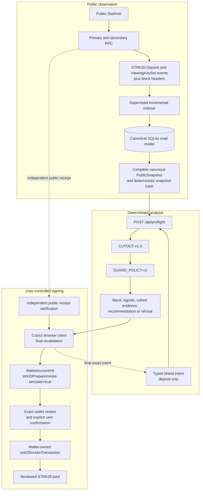

# Cutout release architecture

Cutout has three deliberately separate planes: public observation,
deterministic analysis, and user-controlled execution. Only the wallet can
sign or submit.

## Authority boundaries

| Boundary | Authority | Prohibited capability |
|---|---|---|
| Indexer | Normalize reviewed public pool events and canonical block provenance. | Wallet access, signing, private notes, viewing-key payloads, proofs, or shielded balances. |
| Preflight API | Load one complete snapshot and return deterministic CUTOUT-v1.3 evidence. | Signing, broadcasting, changing the user's token/action/amount, or serving stale evidence as current. |
| Browser | Own user intent, recommendation selection, final review, and wallet-call state. | Bypassing final preflight or broadening user-approved flexibility. |
| Wallet | Hold keys, simulate, display the exact action, request approval, sign, and submit. | Delegating signing authority to the Cutout backend. |
| Receipt verifier | Independently read public inclusion and bind account, pool, token, amount, and event. | Treating a transaction hash alone as proof of the expected deposit. |

## Data flow guarantees

1. The indexer atomically advances its cursor and never publishes a partial
   range as the current snapshot.
2. Reorg, class-hash change, RPC disagreement, missing headers, stale source
   data, and excess index lag withdraw confident evidence.
3. The browser consumes the API result; it does not calculate an independent
   privacy or risk claim.
4. A selected recommendation becomes a new exact intent and is preflighted
   again before simulation.
5. No validation means no wallet call. No verified receipt means no success
   claim.

## Scope

The release supports one reviewed Starknet mainnet STRK20 pool and exactly one
typed `deposit` action. It does not add a Cairo contract because the public
evidence calculation and recommendation do not require onchain authority.
Cutout does not claim anonymity, untraceability, guaranteed unlinkability, or
protection against private wallet, exchange, browser, or RPC telemetry.
